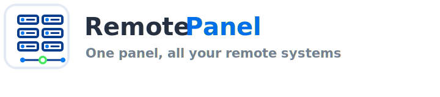
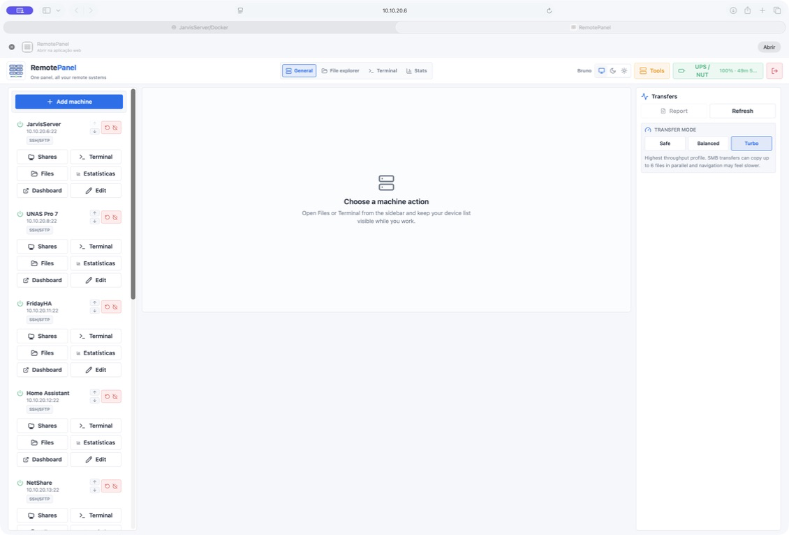
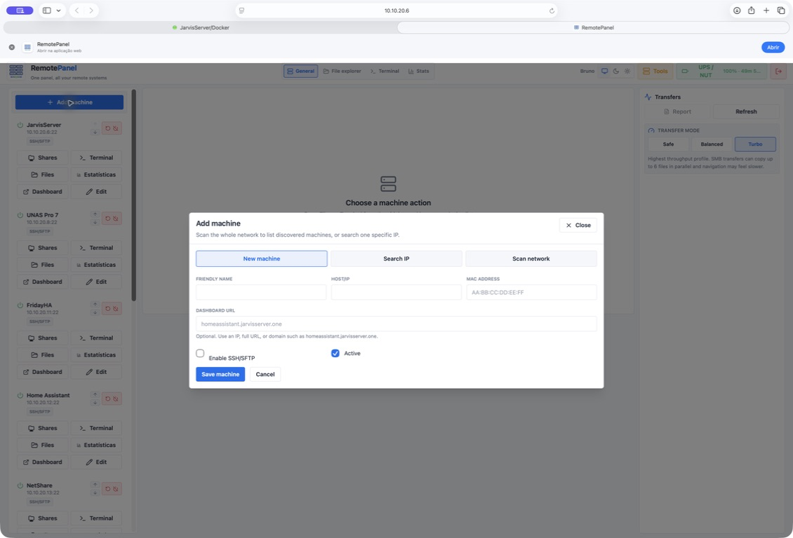
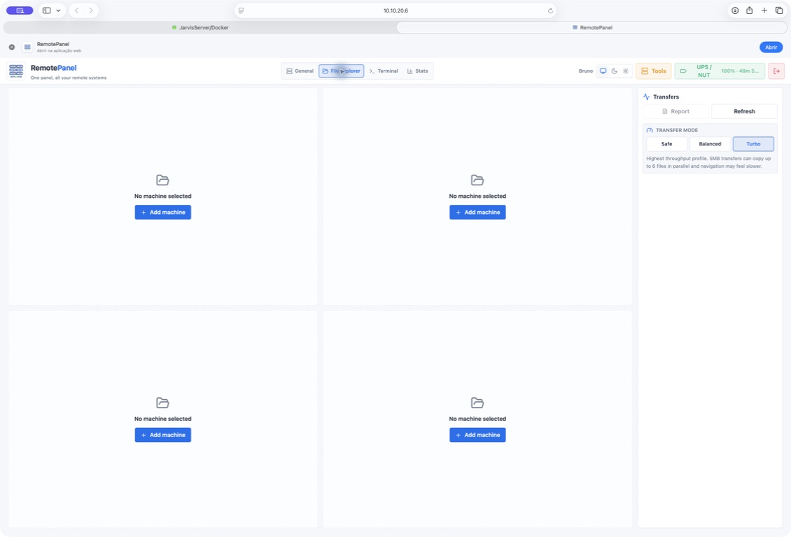
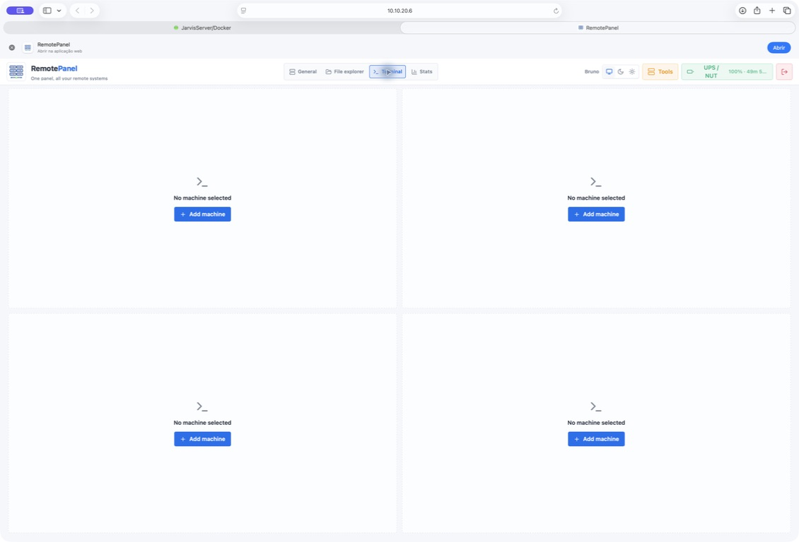
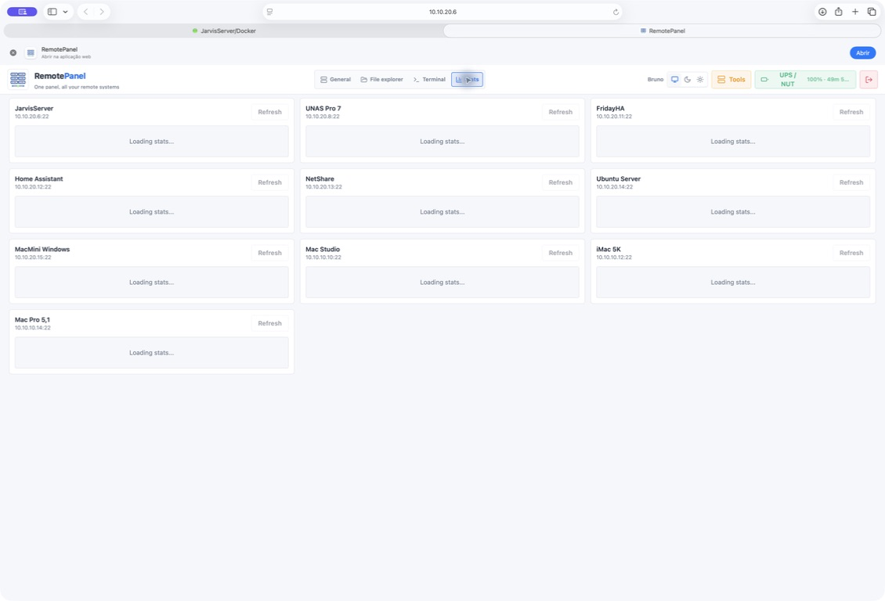
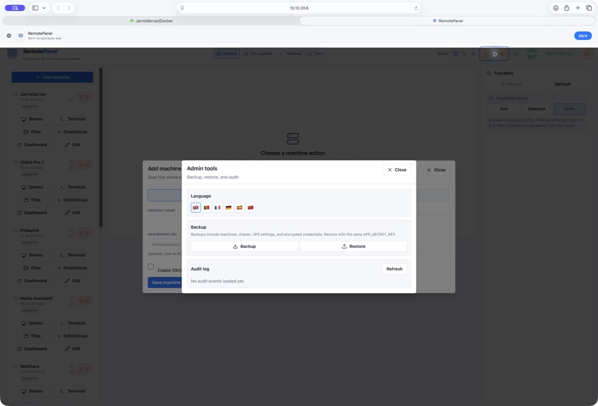
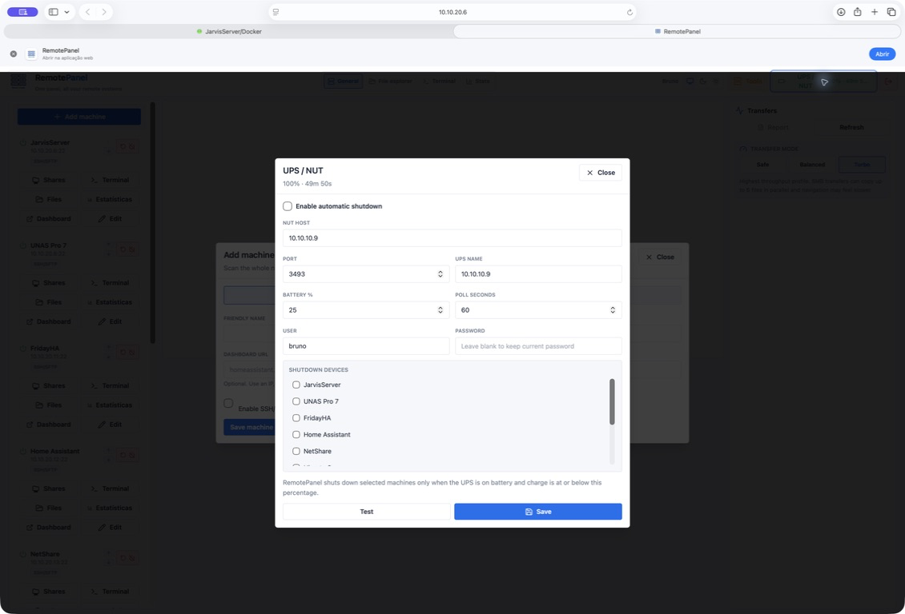

<p align="center">
  
</p>

<p align="center">
  <strong>One panel, all your remote systems</strong>
</p>

RemotePanel is an open-source, self-hosted control panel for homelabs and small server setups.

It gives you one clean web UI to manage machines, SSH terminals, SFTP files, SMB shares, stats, power actions, Wake-on-LAN, dashboards, transfers, backups, audit logs, network discovery, and UPS/NUT shutdown automation.

RemotePanel runs as a single Docker container. The React frontend is built into the image and served by the FastAPI backend. All persistent data lives in `/data`.

```text
ghcr.io/soundflow-dev/remotepanel:latest
```

## What Can It Do?

- Manage Linux, macOS, Windows, FreeBSD, Home Assistant OS, NAS devices, and SMB shares from one place.
- Open SSH terminals in the browser.
- Browse files through SFTP/SSH fallback or SMB shares.
- Copy, move, rename, delete, upload, download, and queue transfers.
- Run large background transfers with progress, speed, ETA, cancellation, retry/recovery reports, and Safe/Balanced/Turbo modes.
- View CPU, memory, disk, uptime, and per-core CPU stats when the target supports it.
- Wake, reboot, and shut down machines when the target allows it.
- Add optional dashboard links for devices such as Home Assistant or Unraid.
- Discover machines on the network and prefill details when possible.
- Create backups, restore backups, and inspect audit logs.
- Configure UPS/NUT safe shutdown rules for selected machines.
- Use light, dark, or system theme.
- Use the UI in English, Portuguese, French, German, Spanish, or Chinese.

## Screenshots

| General dashboard | Add machine and discovery |
| --- | --- |
|  |  |

| File explorer workspace | Terminal workspace |
| --- | --- |
|  |  |

| Stats workspace | Admin tools |
| --- | --- |
|  |  |

| UPS / NUT |
| --- |
|  |

## How RemotePanel Is Organized

RemotePanel has four main tabs:

- **General**: your machine list, shares, files, terminal, stats, dashboards, power actions, transfers, UPS, and tools.
- **File explorer**: up to four file/share explorers at the same time, useful for moving data between machines.
- **Terminal**: up to four terminals at the same time.
- **Stats**: an overview of all configured machines.

The top bar stays available. On mobile and tablet, the navigation adapts into a more compact layout.

## Recommended Hardware

For normal use, RemotePanel is light. A small Linux host, VM, or Unraid server is enough for machine management, terminals, stats, dashboards, and small file tasks.

For very large transfers, especially multi-hundred-GB or multi-TB transfers over multi-Gigabit networking, use more RAM:

- **8 GB RAM**: use Safe mode first.
- **16 GB RAM**: Safe or Balanced is usually a good starting point.
- **32 GB RAM or more**: recommended for heavy multi-Gigabit transfers and Turbo mode.

Network speed matters too. A 600 GB transfer over 1 Gbps is much less stressful than the same transfer over 10 Gbps.

## Important Security Note

RemotePanel stores saved machine credentials encrypted with `APP_SECRET_KEY`.

Set this key once and keep it safe. If you change or lose it, existing saved SSH/SMB credentials cannot be decrypted and must be re-entered.

Generate a key:

```bash
openssl rand -base64 48
```

If `APP_SECRET_KEY` is not set, RemotePanel creates a persistent fallback key in `/data/.app_secret_key`. This works, but you must back up `/data`, including that file.

## Quick Install With Docker Compose

This is the easiest generic Linux install.

### 1. Install Docker

Install Docker and the Compose plugin for your distribution.

On Ubuntu/Debian, Docker's official install guide is recommended. At minimum, confirm these commands work:

```bash
docker version
docker compose version
```

### 2. Clone RemotePanel

```bash
cd /opt
git clone https://github.com/soundflow-dev/remotepanel.git
cd remotepanel
```

### 3. Create `.env`

```bash
cp .env.example .env
nano .env
```

Set at least:

```env
APP_PORT=8080
COOKIE_SECURE=false
APP_SECRET_KEY=replace-this-with-openssl-rand-base64-48
```

### 4. Start RemotePanel

```bash
docker compose up -d
```

Open:

```text
http://SERVER_IP:8080
```

On first launch, create the administrator account.

### 5. Update Later

```bash
cd /opt/remotepanel
git pull
docker compose pull
docker compose up -d
```

## Unraid Install

RemotePanel includes an Unraid template.

Template URL:

```text
https://raw.githubusercontent.com/soundflow-dev/remotepanel/main/unraid/remotepanel.xml
```

The template uses:

- image: `ghcr.io/soundflow-dev/remotepanel:latest`
- Web UI: `http://UNRAID_IP:8090`
- app data: `/mnt/user/appdata/remotepanel/data`
- RemotePanel icon in the Unraid Docker page
- host networking, so network discovery can read the host ARP table when available

### Unraid Steps

1. Open the Unraid terminal.
2. Paste this command to install the RemotePanel template:

   ```bash
   mkdir -p /boot/config/plugins/dockerMan/templates-user && curl -L https://raw.githubusercontent.com/soundflow-dev/remotepanel/main/unraid/remotepanel.xml -o /boot/config/plugins/dockerMan/templates-user/my-remotepanel.xml
   ```

3. Open the Unraid web UI.
4. Go to **Docker**.
5. Click **Add Container**.
6. In **Template**, choose **RemotePanel**.
7. Generate `APP_SECRET_KEY`:

   ```bash
   openssl rand -base64 48
   ```

8. Paste the generated value into the template's `APP_SECRET_KEY` field.
9. Apply the template.
10. Open:

   ```text
   http://UNRAID_IP:8090
   ```

11. Create the administrator account.

Do not change `APP_SECRET_KEY` after adding machines.

### Update on Unraid

If you installed through the Unraid template, use the Unraid Docker page update button when it appears.

If you installed manually from the cloned repo, use:

```bash
cd /mnt/user/appdata/remotepanel
git pull
docker compose pull
docker compose up -d
```

### Clean Unraid Install

Warning: this removes RemotePanel and all RemotePanel data.

```bash
docker rm -f remotepanel
docker rmi -f ghcr.io/soundflow-dev/remotepanel:latest
rm -rf /mnt/user/appdata/remotepanel
```

Then install again.

To remove unused Docker images after testing:

```bash
docker image prune -f
```

## Adding Machines

Click **Add machine**.

You can:

- add a machine manually
- search a specific IP
- scan a network range such as `10.10.20.0/24`

For SSH/SFTP features, the target machine must have SSH enabled:

- **Linux/FreeBSD**: install and enable OpenSSH Server.
- **macOS**: enable **System Settings > General > Sharing > Remote Login**.
- **Windows 10/11 or Windows Server**: install/enable OpenSSH Server and use a local account.
- **Home Assistant OS**: SSH works where Home Assistant permissions allow it.

You can optionally add:

- MAC address, for Wake-on-LAN
- dashboard URL, for links such as `homeassistant.local`, `homeassistant.jarvisserver.one`, `http://10.10.20.6`, or `https://example.com`

Dashboard links open in a new browser tab. This avoids iframe restrictions used by apps such as Home Assistant, Unraid, and many routers.

## SMB Shares

Add SMB shares inside a machine through **Shares**.

Accepted path formats:

```text
smb://10.10.20.8/Media
\\10.10.20.8\Media
```

If a machine has several shares, add each one under the same machine.

## Power Actions

RemotePanel can send:

- Wake-on-LAN
- reboot
- shutdown

Power actions require the target system to support the command and the saved SSH user to have permission to run it without an interactive password prompt.

Windows uses native Windows shutdown commands. macOS, Linux, FreeBSD, and Home Assistant OS use their appropriate SSH commands where possible.

Wake-on-LAN requires a correct MAC address and compatible hardware/network configuration.

## Transfers

RemotePanel supports background transfer jobs with:

- progress
- speed
- ETA
- cancel
- queue
- retry/recovery for stalled large transfers
- transfer report after completion or failure

There are three transfer modes:

| Mode | Use it when | Notes |
| --- | --- | --- |
| Safe | The server has less RAM or you want maximum UI responsiveness | Lowest resource usage. Best first test on small hosts. |
| Balanced | You want to keep using the app while transfers run | Recommended default. Good mix of speed and responsiveness. |
| Turbo | You want maximum speed and will mostly leave the app alone | Best for large transfers, for example overnight. UI navigation may feel slower. |

Choose the mode before starting transfers. Active transfers keep the mode they started with, so the selector is locked until active transfers finish.

### Transfer Reports

The **Report** button in the Transfers panel shows:

- retries
- worker restarts
- stalls
- resumed files
- skipped files
- errors
- rewritten tail size for resumed partial files

This is useful when testing very large transfers.

## UPS / NUT Shutdown Automation

RemotePanel can connect to a NUT server and safely shut down selected machines when the UPS battery gets low.

Configure **UPS / NUT** from the top bar.

Typical fields:

```text
NUT host: 10.10.20.10
NUT port: 3493
UPS name: ups
Battery threshold: 25
Poll seconds: 60
```

RemotePanel only sends shutdown commands when the UPS reports battery mode (`OB`) or low battery (`LB`) and the charge is at or below the configured threshold.

It does not shut machines down just because the battery is below 100% while the UPS is online.

The selected machines must already have working SSH/SFTP credentials and working shutdown permissions.

## Backups and Restore

Open **Tools** in the top bar.

Backups include:

- machines
- SMB shares
- dashboard URLs
- UPS/NUT settings
- encrypted saved credentials

Restore requires the same `APP_SECRET_KEY` if you want saved credentials to keep working.

For a server migration:

1. Install RemotePanel on the new server.
2. Use the same `APP_SECRET_KEY`.
3. Create the first administrator.
4. Open **Tools**.
5. Restore the backup JSON.

You can also back up the data directory manually:

```bash
tar -czf remotepanel-data-backup.tar.gz -C /mnt/user/appdata/remotepanel data
```

If you use a `.env` file, back it up too.

## Audit Log

The **Tools** panel includes an audit log for administrative actions such as:

- machine changes
- share changes
- power actions
- backup export
- backup restore
- discovery scans

## Network Discovery Notes

Discovery scans IPv4 ranges such as:

```text
10.10.20.0/24
```

It checks common services such as SSH, SMB, RDP, HTTP, and HTTPS.

MAC address prefill depends on what the RemotePanel host can see in its ARP table. On routed networks or different VLANs, the IP may be found but the MAC address may not be available.

Discovery is a helper. It never adds machines automatically without you choosing them.

## Advanced Transfer Tuning

Most users should start with the UI transfer modes and leave these settings alone.

Optional `.env` settings:

```env
TRANSFER_CHUNK_SIZE=67108864
TRANSFER_PREFETCH_CHUNKS=16
TRANSFER_PARALLEL_FILES=2
TRANSFER_SMB_PARALLEL_FILES=6
TRANSFER_FILE_STREAMS=16
TRANSFER_SMB_FILE_STREAMS=1
TRANSFER_FILE_STREAM_MIN_SIZE=1073741824
TRANSFER_RESUME_BLOCK_SIZE=536870912
TRANSFER_RESUME_REWIND_BYTES=268435456
TRANSFER_RESUME_REWRITE_FULL=false
TRANSFER_MEMORY_TRIM_BYTES=53687091200
TRANSFER_MEMORY_TRIM_PAUSE_SECONDS=1
TRANSFER_MEMORY_DEEP_TRIM_BYTES=214748364800
TRANSFER_MEMORY_DEEP_TRIM_PAUSE_SECONDS=5
TRANSFER_MEMORY_DEEP_TRIM_PASSES=3
TRANSFER_PROGRESS_COMMIT_BYTES=268435456
TRANSFER_PROGRESS_COMMIT_SECONDS=2
TRANSFER_CANCEL_CHECK_SECONDS=1
TRANSFER_STALL_TIMEOUT_SECONDS=300
TRANSFER_WORKER_RESTARTS=5
SMB_REQUIRE_SIGNING=true
SMB_AUTH_PROTOCOL=negotiate
```

Useful notes:

- `TRANSFER_SMB_PARALLEL_FILES` controls how many separate SMB files can be copied in parallel in Turbo mode.
- `TRANSFER_SMB_FILE_STREAMS` defaults to `1` because many SMB servers behave better with sequential writes per file.
- `TRANSFER_MEMORY_TRIM_BYTES` asks Python/Linux to release unused memory after a global transfer interval.
- `TRANSFER_STALL_TIMEOUT_SECONDS` and `TRANSFER_WORKER_RESTARTS` protect large transfers from hanging forever.
- `TRANSFER_RESUME_REWIND_BYTES` rewrites the end of a partial destination file before resuming.
- `SMB_REQUIRE_SIGNING=false` may improve SMB speed on trusted networks if your SMB server allows it.

## Monitoring Memory on Unraid

During very large transfers, Unraid or `docker stats` may show high Docker memory usage. That can include kernel/container accounting and I/O-related memory.

The most useful host-side value is `available`:

```bash
free -h
```

Live monitoring:

```bash
watch -n 5 "free -h && echo && docker stats --no-stream remotepanel"
```

Container memory breakdown:

```bash
docker exec remotepanel sh -c "cat /sys/fs/cgroup/memory.stat 2>/dev/null | egrep 'anon|file|kernel|slab'"
```

As a rule of thumb:

- high `anon` usually means real process memory
- high `file` usually means file/cache memory
- low `anon` with healthy `available` usually means the system still has memory headroom

## Development

Backend:

```bash
cd backend
python -m venv .venv
source .venv/bin/activate
pip install -r requirements.txt
APP_SECRET_KEY=dev-secret DATA_DIR=./data uvicorn app.main:app --reload
```

Frontend:

```bash
cd frontend
npm install
npm run dev
```

Set `VITE_API_BASE=http://localhost:8000/api` when running frontend and backend on separate dev ports.

Production image build:

```bash
docker build -t remotepanel .
```

## License

MIT
